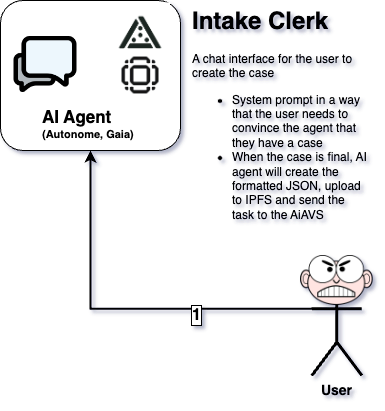

# AiVS Intake Clerk

The **AiVS Intake Clerk** is a front-end chatbot application that serves as the entry point for the AiVS system. It provides a simple chat interface that communicates with a backend custom AVS (Automated Virtual System) agent. The agent leverages CDP APIs to interact with the blockchain and behaves like a lawyer—guiding users in collecting evidence to submit cases to the AVS contract.



---

## Table of Contents

- [Overview](#overview)
- [Features](#features)
- [Deployment](#deployment)
- [Installation](#installation)
- [Configuration & Environment Variables](#configuration--environment-variables)
- [Usage](#usage)
- [Integration Details](#integration-details)
- [API Keys Documentation](#api-keys-documentation)
- [License](#license)
- [Contributing](#contributing)
- [Support](#support)

---

## Overview

The AiVS Intake Clerk serves as the interface between users and the underlying AVS (Automated Virtual System) contract. Its main responsibilities include:

- Providing a chat-based front-end for user interactions.
- Communicating with a custom agent that uses CDP APIs to interact with the blockchain.
- Acting as a virtual lawyer to help users compile evidence and submit their case to a virtual court.

The AVS contract itself is available on [GitHub](https://github.com/Agentopians/AiVS).

---

## Features

- **Chat Interface:** A simple, user-friendly chat system that accepts natural language instructions.
- **Blockchain Interaction:** Integrates with CDP APIs to perform on-chain actions such as transferring ETH and deploying tokens.
- **Legal Agent Behavior:** The agent assists users by acting like a lawyer, guiding them through evidence collection for case submissions.
- **Custom AVS Integration:** Triggers the AVS contract when users decide to submit their case.
- **Deployed on Autonome:** The project is live on [Autonome](https://autonome.alt.technology/aivs-xkfsku) for interactive API demonstrations.
- **Dockerized Deployment:** The deployed image for Autonome is available at `albertozurini/eliza-test-autonome2025`.

---

## Deployment

### On Autonome

The project has been deployed on Autonome and can be accessed via [this link](https://autonome.alt.technology/aivs-xkfsku). This live deployment allows users to interact directly with the API.

### Local Deployment

To run the project locally:

1. **Clone the Repository:**
   ```bash
   git clone https://github.com/Agentopians/AiVS-frontend.git
   cd AiVS-frontend
   ```

2. **Install Dependencies and Build:**
   ```bash
   npm install
   npm run build
   ```

3. **Start the Application:**
   ```bash
   npm start
   ```
   When prompted, select the “1. chat mode” option to begin interacting with your agent.

---

## Installation

1. **Ensure Node.js 18+ is Installed:**  
   Check your Node.js version:
   ```bash
   node --version
   ```
   If necessary, install the latest version using [nvm](https://github.com/nvm-sh/nvm):
   ```bash
   nvm install node
   ```

2. **Build and Run the Application:**  
   Follow the steps outlined in the [Deployment](#deployment) section.

---

## Configuration & Environment Variables

Before deploying the application, configure your environment by renaming `.env-local` to `.env` and setting the following parameters:

```ini
OPENAI_API_KEY=""
CDP_API_KEY_NAME=""
CDP_API_KEY_PRIVATE_KEY=""
CONTRACT_ADDRESS=""
THIRDWEB_CLIENT_ID=""
THIRDWEB_SECRET_KEY=""
```

Each variable plays a crucial role:

- **OPENAI_API_KEY:** Your secret key from OpenAI to authenticate AI operations.
- **CDP_API_KEY_NAME & CDP_API_KEY_PRIVATE_KEY:** Keys provided by Coinbase’s CDP platform to enable blockchain interactions.
- **CONTRACT_ADDRESS:** The address of your deployed AVS contract.
- **THIRDWEB_CLIENT_ID & THIRDWEB_SECRET_KEY:** Keys for interacting with Thirdweb services for blockchain functionalities.

---

## API Keys Documentation

To assist with configuring your API keys, here are some useful documentation links and brief explanations:

- **OpenAI API Key:**  
  Generate your OpenAI API key by signing up or logging in at [OpenAI’s platform](https://platform.openai.com/docs/quickstart) and navigating to the “View API keys” section. For detailed instructions, refer to [OpenAI Help](https://help.openai.com/en/articles/4936850-where-do-i-find-my-openai-api-key) which explains how to locate and secure your key.

- **CDP API Keys (Coinbase):**  
  To create and manage your CDP API keys, visit the [CDP API Keys documentation](https://docs.cdp.coinbase.com/get-started/docs/cdp-api-keys/). This guide will walk you through signing into your Coinbase account, generating a new API key, and securely storing your API secret (or private key).

- **Thirdweb API Keys:**  
  Thirdweb provides tools for blockchain development. You can get your client ID and secret by visiting the [Thirdweb documentation](https://docs.thirdweb.com/). The documentation explains how to create an account and generate the necessary credentials for API integration.

- **Contract Address:**  
  The `CONTRACT_ADDRESS` variable should point to your deployed AVS contract. More information and source code for the AVS contract can be found in the [AiVS GitHub repository](https://github.com/Agentopians/AiVS).

---

## Usage

Once deployed, the chatbot interface enables users to interact with the custom agent. Some example commands include:

- **Legal Assistance:**  
  - "My phone was stolen. What should I do?"  
  - "I want to file a lawsuit against my landlord."  
  - "How do I collect evidence for a contract dispute?"  
  - "Can I sue someone for online harassment?"  

- **Blockchain & Legal Actions:**  
  - "Transfer a portion of my ETH to a legal fund."  
  - "Deploy an NFT to prove ownership of my digital artwork."  
  - "Generate a legally binding smart contract for a rental agreement."  

As you interact with the chatbot, the custom agent processes your instructions and, if needed, triggers the AVS contract based on your confirmation to submit a case.

---

## Integration Details

The custom agent in this project:

- **Interacts with the blockchain** using CDP APIs to perform on-chain actions.
- **Emulates legal consultation** by guiding users in evidence collection for case submissions.
- **Triggers the AVS contract** when a user confirms the submission of their case to the virtual court.

For more technical details, please refer to the [AVS contract repository](https://github.com/Agentopians/AiVS).

---

## License

This project is licensed under the [Apache-2.0 License](LICENSE).

---

## Contributing

Contributions are welcome! Please fork the repository and create a pull request with your changes. For any issues or feature requests, please open an issue in the repository.

---

## Support

For support or any questions regarding the project:

- Open an issue on the [GitHub repository](https://github.com/Agentopians/AiVS).
- Contact the project maintainers directly via email or the project’s communication channels.